# LaMus — Self-Hosted Discord Music System

LaMus is a high-performance, self-hosted Discord music bot ecosystem engineered for ARM architectures (such as Raspberry Pi). It features a modern Single Page Application (SPA) WebUI, real-time WebSocket synchronization, a decentralized multi-instance architecture, and a fully autonomous audio pipeline powered by a dedicated Lavalink node.

<p align="center">
  
</p>

<p align="center">
  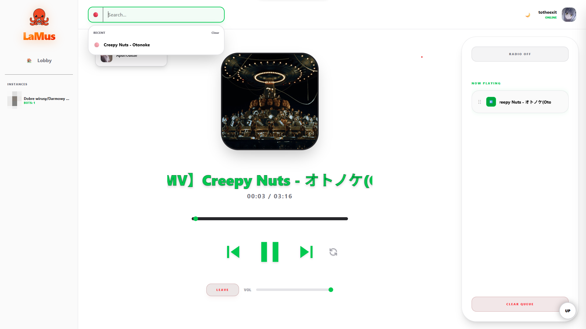
</p>

---

## Table of Contents

- [Motivation](#motivation)
- [Features](#features)
- [WebUI Walkthrough](#webui-walkthrough)
- [System Architecture](#system-architecture)
  - [Distributed Components](#distributed-components)
  - [Data Flow & Communication](#data-flow--communication)
- [Tech Stack](#tech-stack)
- [Repository Structure](#repository-structure)
- [Permission System & Session Affinity](#permission-system--session-affinity)
- [Local Library & Search Engine](#local-library--search-engine)
- [Deployment](#deployment)
  - [Prerequisites](#prerequisites)
  - [Quick Start](#quick-start)
  - [Configuration Reference](#configuration-reference)
  - [Docker Services](#docker-services)
- [ARM Deployment & CGNAT Bypass](#arm-deployment--cgnat-bypass)
- [Resource Usage & Efficiency](#resource-usage--efficiency)
- [Troubleshooting](#troubleshooting)
- [Roadmap](#roadmap)

---

## Motivation

Centralised public music bots for Discord suffer from a predictable set of problems: shared infrastructure that degrades under load, latency spikes and stream drops during peak hours, aggressive subscription paywalls locking away basic features like volume control or loop, and complete dependency on a third-party operator with no recourse when the service goes down.

LaMus was built to eliminate all of these. Deployed on a private ARM device and exposed through a secure reverse tunnel, every instance of LaMus is fully owned and operated by its user. There are no subscriptions, no rate-limit surprises from a shared pool, and no paywalled features. The entire codebase is compiled natively for the target platform, keeping the memory footprint low enough to run comfortably on a Raspberry Pi 4B alongside other services.

---

## Features

- **Modern WebUI** — React-based browser interface; no need to type chat commands for everyday control.
- **Real-Time Sync** — WebSocket-powered state broadcasting. Actions taken by any user update all connected dashboards instantly.
- **Multi-Instance Support** — Multiple independent bot instances across different Discord servers and voice channels, all managed from one panel.
- **Local & Network Audio** — Stream from external sources or play from a massive private local library. Network sources (e.g. YouTube via plugin) can be enabled through the Lavalink configuration.
- **OAuth2 Authentication** — Users log in through Discord. Regular users see only bots on servers they are actively in. Superadmins have global visibility.
- **Drag & Drop Queue Management** — Reorder, jump to, or remove tracks directly from the queue panel.
- **Slash Command Support** — An observer bot registers Discord application commands (`/search`, `/searchlocal`, `/skip`, `/leave`, `/pause`, `/resume`, `/clear`) for users who prefer in-chat control.
- **CGNAT Bypass** — A built-in Ngrok container creates a secure reverse tunnel, making the WebUI and Discord callbacks accessible globally without router reconfiguration.
- **Highly Optimised** — Rust + Tokio core with near-zero idle RAM (~11 MiB), paired with a memory-capped Lavalink audio engine. Max power draw on Raspberry Pi 4B: ~5 W.
- **Radio Mode** — Automatic track selection from local library or network sources when the queue runs dry.
- **Loop, History & Previous Track** — Full playback control including per-track looping and backward navigation through history.
- **Dark & Light Mode** — Full theme support across all views.
- **Fully Responsive** — Works on desktop, tablet, and mobile.

---

## WebUI Walkthrough

### Login

Authentication is handled entirely through Discord OAuth2. No separate account is needed — click **Log in with Discord**, authorise the application, and you are redirected straight into the panel.

<p align="center">
  
  &nbsp;&nbsp;
  
</p>

<p align="center">
  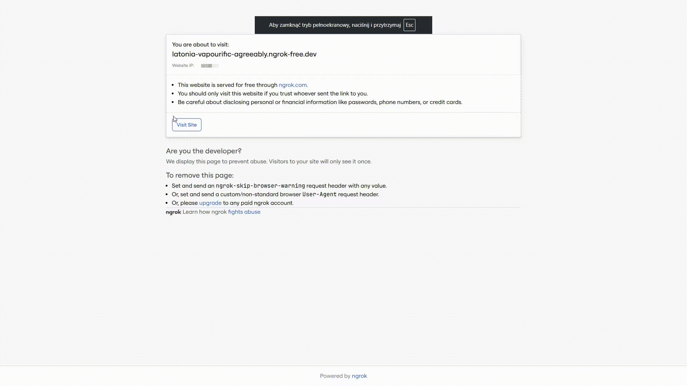
</p>

---

### Server Lobby

After login, users see a grid of Discord servers the system is currently aware of. Servers with active playback are marked accordingly. Superadmins see all servers; regular users only see servers they share with the bot.

<p align="center">
  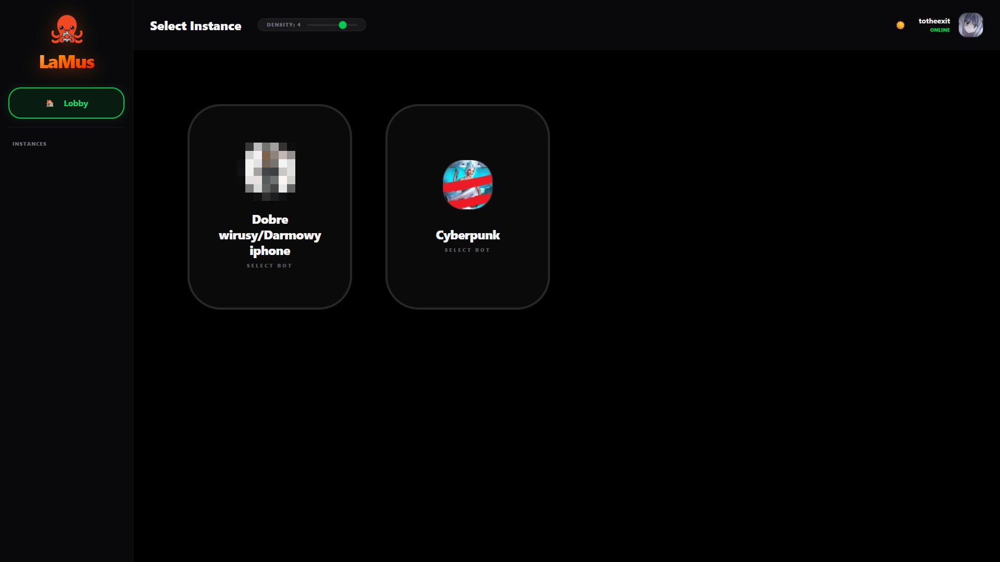
  &nbsp;&nbsp;
  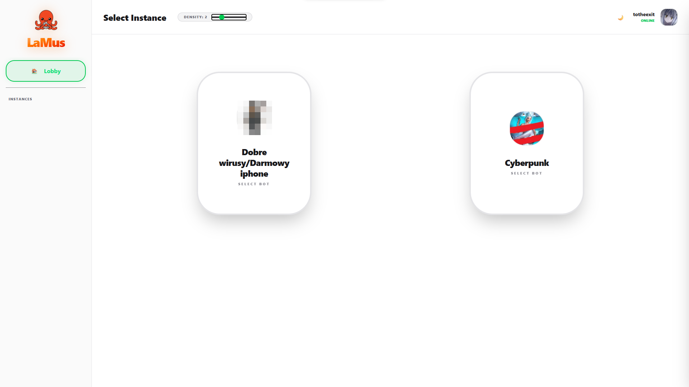
</p>

---

### Bot Selection

After choosing a server, users pick which bot instance to control. Bots that are busy on a different voice channel, or which the user lacks permission for, are displayed as unavailable.

<p align="center">
  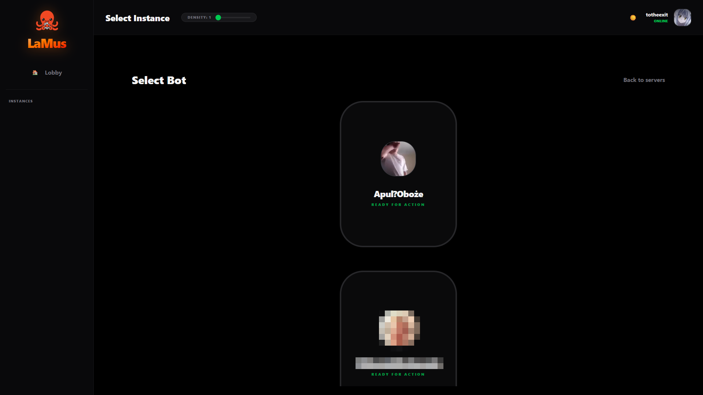
  &nbsp;&nbsp;
  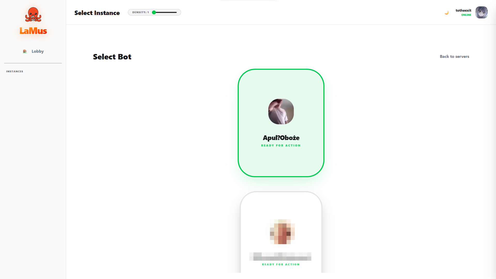
</p>

---

### Voice Channel Selection

A modal lists all visible voice channels in the server. Selecting one sends the bot a join command and switches the view directly to the player.

<p align="center">
  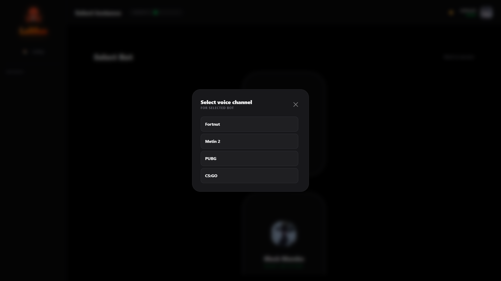
  &nbsp;&nbsp;
  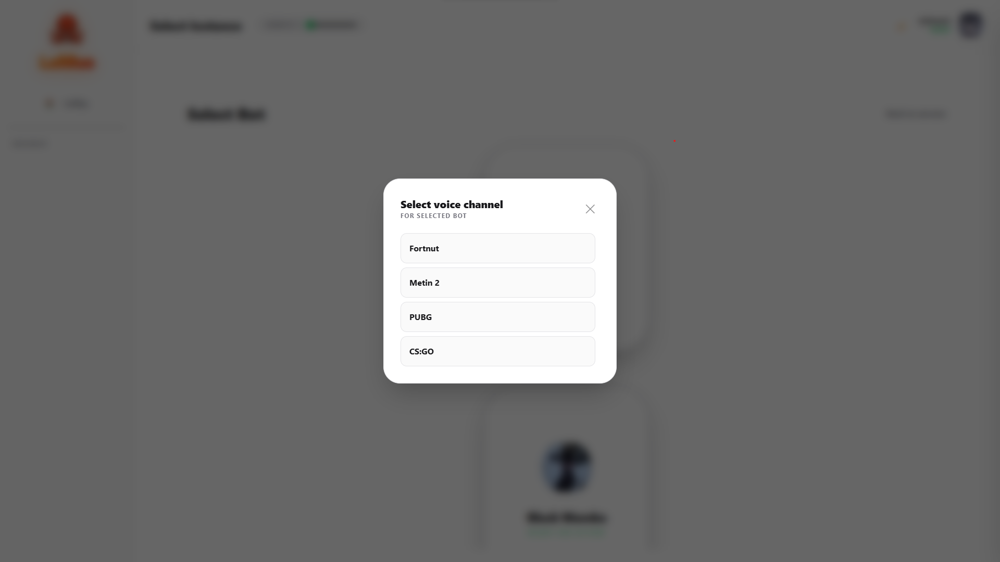
</p>

---

### Player

The main player view shows the current track, cover art (fetched automatically for network tracks), a seek bar, playback controls, and a volume slider. The queue panel on the right displays playback history above the current track and upcoming tracks below — all scrollable and fully interactive.

<p align="center">
  
</p>

<p align="center">
  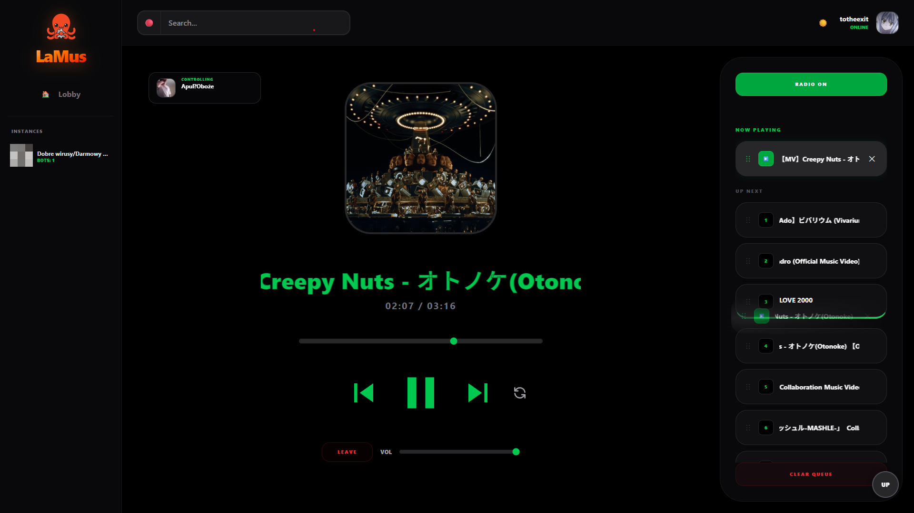
</p>

The GIF below shows searching for a track, adding it to the queue, and watching it start playing.

<p align="center">
  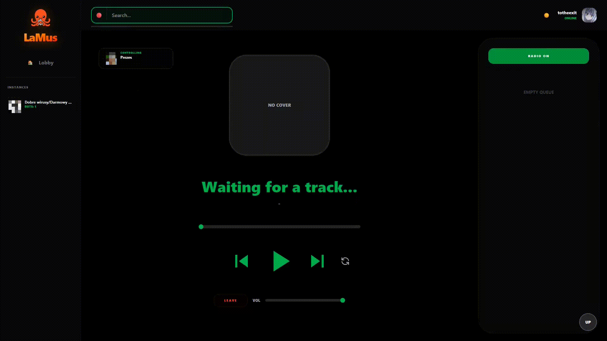
</p>

**No cover art?** The player falls back gracefully — controls remain fully functional.

<p align="center">
  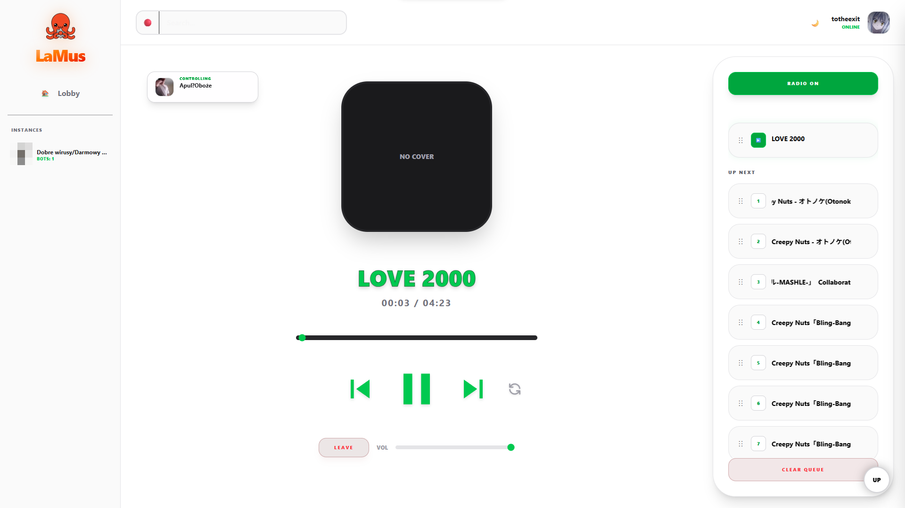
</p>

---

### Local Library Search

Switch the search input to **Library mode** (📁) to query the local track database. Results are ranked by token match score and appear as a live dropdown. Selecting a result immediately adds the track to the queue.

<p align="center">
  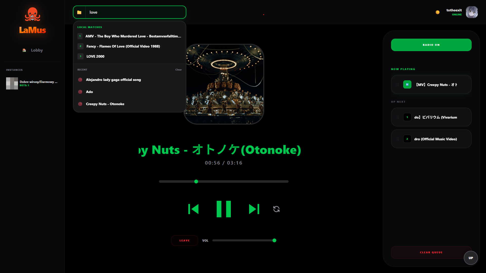
</p>

---

### Active Instances (Superadmin View)

Superadmins see a folder-style navigation in the sidebar grouping active bot instances by server. Clicking a server folder reveals all currently active players, each showing the bot's avatar and live status. Any instance can be taken over and controlled directly from this panel.

<p align="center">
  
</p>

---

### Discord Slash Commands

LaMus works directly from Discord chat via slash commands. The observer bot registers `/search`, `/searchlocal`, `/skip`, `/leave`, `/pause`, `/resume`, and `/clear` globally. The bot detects which voice channel the user is in, routes the command to the correct instance, and responds inline.

<p align="center">
  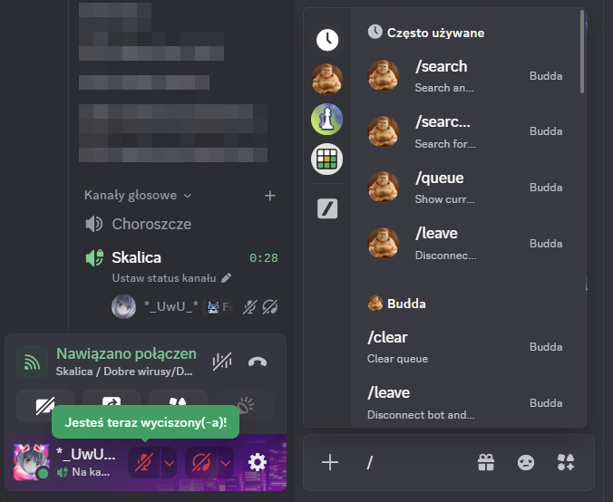
  &nbsp;&nbsp;
  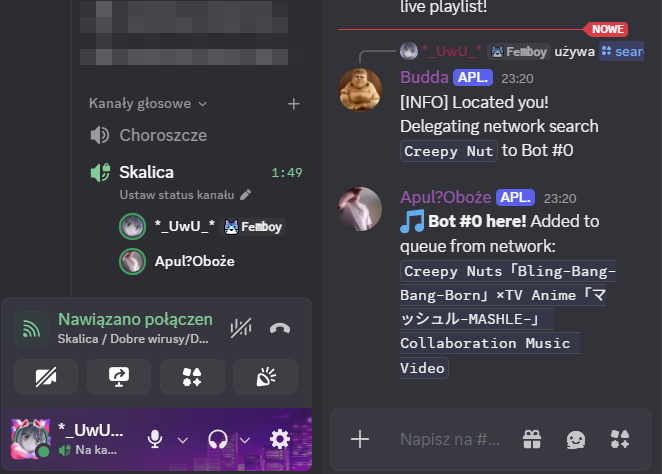
</p>

<p align="center">
  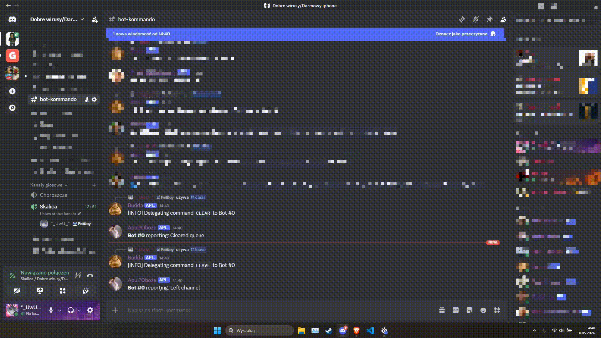
</p>

---

### Mobile

The interface is fully responsive. On narrow viewports the layout switches to a single-column design with touch-friendly controls and a bottom navigation bar.

<p align="center">
  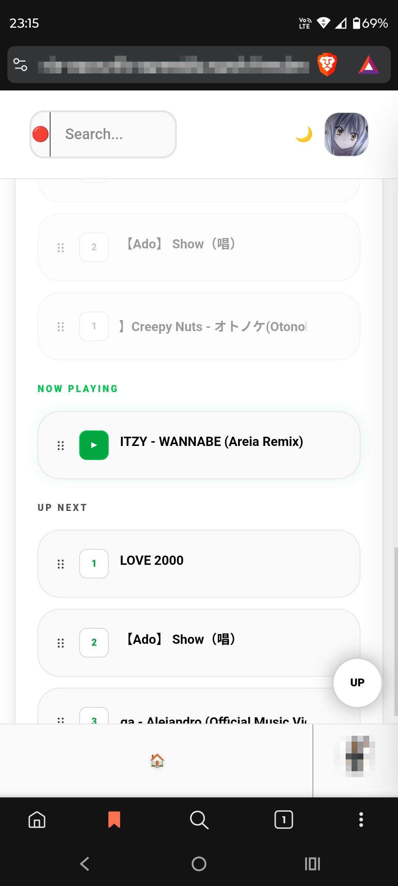
  &nbsp;
  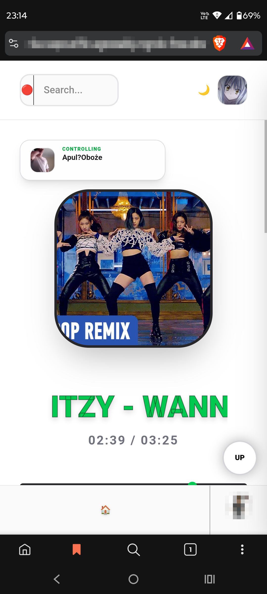
  &nbsp;
  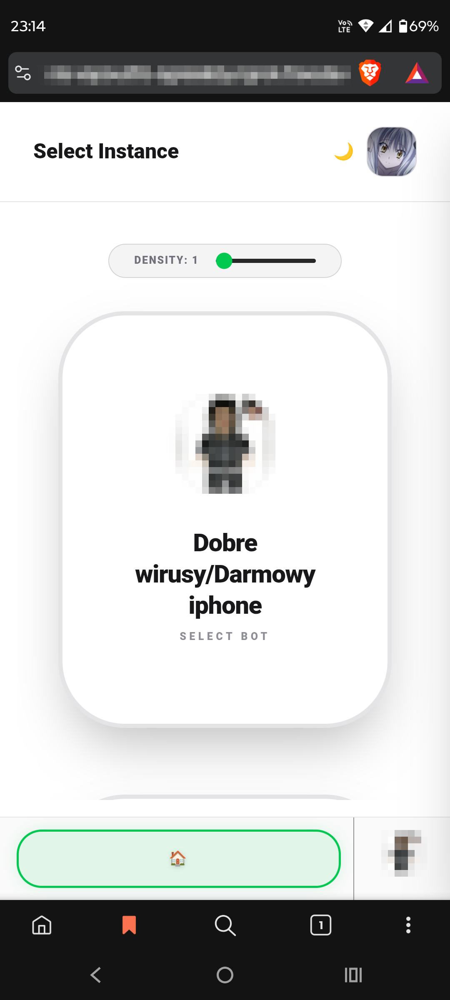
  &nbsp;
  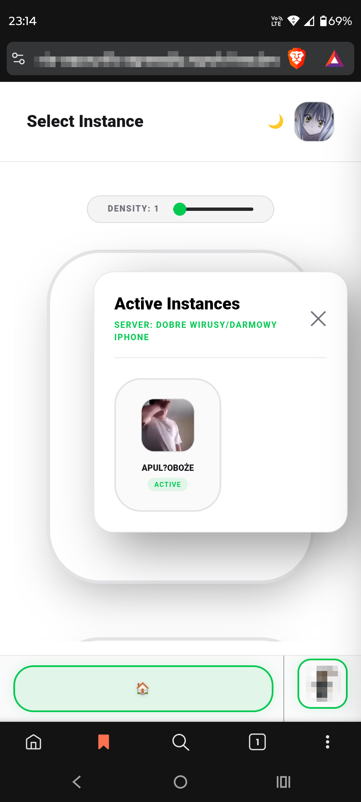
</p>

---

## System Architecture

### Distributed Components

The system is divided into four cooperating layers:

```
┌─────────────────────────────────────────────────────────────┐
│                        WebUI (React SPA)                    │
│            Browser — WebSocket + REST over HTTPS            │
└────────────────────────────┬────────────────────────────────┘
                             │
┌────────────────────────────▼────────────────────────────────┐
│                   Core Backend (Rust / Tokio)               │
│  Orchestrator · Command Router · State Machine · OAuth2     │
│  HiveMind · Persistence · WebSocket Server · REST API       │
└──────────┬──────────────────────────────────┬───────────────┘
           │ WSS (Discord Gateway)            │ REST + WS
           │                                  │
┌──────────▼──────────┐             ┌─────────▼───────────────┐
│  Discord Platform   │             │   Lavalink Audio Engine  │
│  Gateway · Voice    │◄────UDP────►│   (Java / JVM)           │
│  Servers            │             │   Track decode · Stream  │
└─────────────────────┘             └─────────────────────────┘
```

**Core Backend (Rust)** is the central orchestrator. It accepts commands from the WebUI and from Discord slash commands, verifies permissions, manages the lifecycle of bot instances, and coordinates the audio engine. Its event-driven design, built on Tokio's async runtime, allows it to maintain thousands of concurrent WebSocket connections and Discord gateway sessions without allocating a thread per connection.

**Lavalink** is an isolated audio node (Java/JVM). It handles all the resource-intensive work: fetching track metadata from external sources, buffering, decoding, and continuously streaming Opus-encoded audio frames over UDP directly to Discord voice servers. This separation prevents audio processing from ever blocking the main event loop.

**WebUI** is a React SPA that communicates exclusively through the defined network protocols. It never has direct access to bot internals; all interaction flows through the authenticated REST API and the live WebSocket channel.

**External Infrastructure** encompasses Discord's servers, and the Ngrok reverse tunnel that bridges the private LAN on the Raspberry Pi to the public internet.

### Data Flow & Communication

The system uses a hybrid communication model:

| Channel | Protocol | Purpose |
|---|---|---|
| WebUI ↔ Backend | REST (HTTP) | One-time operations: login, initial state fetch, command dispatch |
| WebUI ↔ Backend | WebSocket | Continuous bidirectional sync: player state push, real-time updates |
| Backend ↔ Discord | WSS (Discord Gateway) | Event stream: voice state changes, command interactions |
| Backend ↔ Lavalink | REST + WebSocket | Track search / control commands; TrackEnd event callbacks |
| Lavalink ↔ Discord | UDP (Opus) | Raw audio stream to voice servers |

Commands travel through a normalisation layer before reaching any bot instance. Whether a command originates from a Discord slash interaction or a WebUI button click, it is decoded and mapped to the same internal `Command` enum before being dispatched — there is no duplicated business logic between the two input paths.

---

## Tech Stack

| Layer | Technology | Rationale |
|---|---|---|
| Backend core | **Rust** + **Tokio** | Zero-GC memory model; predictable latency under load; ARM64 native compilation |
| Discord integration | **Serenity** + **Songbird** | Mature Discord library; handles gateway, REST, and voice in one ecosystem |
| Audio engine | **Lavalink** (Java) | Proven audio node; efficient multi-stream scaling after JVM warmup |
| Lavalink client | **lavalink-rs** | Rust-native async Lavalink client |
| Web server | **Axum** | Ergonomic async HTTP + WebSocket routing on Tokio |
| Frontend | **React 19** + **TypeScript** | Component model ideal for reactive player state; virtual DOM minimises repaints |
| Build tool | **Vite** | Fast development builds; highly optimised production bundles |
| Styling | **Tailwind CSS v4** | Utility-first; zero-runtime CSS overhead in production |
| Containerisation | **Docker** + **Docker Compose** | Reproducible multi-arch builds; strict JVM heap cap for Lavalink |
| Tunnel | **Ngrok** | Reverse tunnel for CGNAT environments; no router changes required |
| Serialisation | **serde** + **serde_yaml** + **serde_json** | Type-safe config loading and JSON message passing |
| Local audio | **Symphonia** | Pure-Rust audio decoder; reads MP3/WAV/FLAC frame counts for accurate durations |

---

## Repository Structure

```
.
├── Cargo.toml                    # Rust workspace
├── Dockerfile                    # Multi-stage build (frontend → backend → runtime)
├── docker-compose.example.yml    # Service definitions (lavalink, lamus-bot, ngrok)
├── config.example.yaml           # Main application configuration
├── application.example.yml       # Lavalink node configuration
├── normalization.yaml            # Token normalisation rules for local search
├── screenshots/                  # UI screenshots and demo GIFs
│
├── crates/
│   ├── core/           # State machine, queue, playback, events, HiveMind, normalisation
│   ├── auth/           # Discord OAuth2 flow; HTTP-only session cookies
│   ├── audio_lavalink/ # Lavalink REST + WebSocket client; TRACK_END_TX global
│   ├── discord_adapter/# Serenity event handler; voice join/leave; slash commands
│   ├── web_ui/         # Axum HTTP server; WebSocket broadcaster; command handler
│   ├── persistence/    # File scanner (walkdir); duration probe (Symphonia); SHA-1 ID gen
│   └── app/            # main.rs: wires all crates; HiveMind; command router event loop
│
└── webui/              # React + Vite SPA
    ├── src/
    │   ├── App.tsx     # Root component: all views, WebSocket client, state
    │   └── index.css   # Tailwind imports + custom animations (marquee, drag-over)
    └── index.html
```

### Core Crate Responsibilities

**`crates/core`** is the heart of the system. It contains:
- `CoreState` — the bot instance state machine, handling every `Command` and emitting `Event` values.
- `Queue` — the ordered track list with push, remove, move, insert-at-front, and clear operations.
- `PlaybackState` — mode (Playing / Paused / Stopped), position, volume, loop flag, and playback instance ID.
- `HiveMind` — shared registry of all bot records, user voice states, cached player states, and voice channel lists. The single source of truth for routing decisions.
- `normalize` — configurable token extractor used to build the pre-computed search index.

**`crates/app`** (`main.rs`) is the composition root. It starts all subsystems in parallel Tokio tasks and runs the main `select!` loop that routes `CoreMessage` values to the correct bot node.

---

## Permission System & Session Affinity

LaMus implements a layered permission model without an external database:

1. **Superadmins** (defined in `config.yaml`) have global visibility and control over all bot instances across all servers.
2. **Regular users** can only see and control bots that are in the same voice channel as them. The HiveMind tracks each Discord user's current `(guild_id, channel_id)` in real-time via the Observer bot's `voice_state_update` events.
3. **WebSocket data scoping** — regular users only receive state updates for players they are allowed to interact with. Superadmins receive the full multi-player state map.
4. **Bot limit per channel** — configurable `max_bots_per_channel` prevents a single channel from being monopolised.

Command authorisation is **stateless**: the backend checks the caller's voice channel against the HiveMind registry on every request without hitting any external store, keeping latency negligible.

### Session Ownership & Democratic Control

LaMus introduces a lightweight session management model designed to prevent conflicts when multiple users interact with the same bot instance.

- **Session Ownership** — the user who initially invites a bot into a voice channel becomes the session owner. By default, only the owner may perform disruptive actions such as skipping tracks or modifying the queue.
- **Open Sessions** — the owner may choose to open the session to everyone currently present in the voice channel.
- **Vote-Skip System** — for open sessions, potentially disruptive actions require approval from a configurable percentage of active voice channel members. Voting lasts for 15 seconds and is automatically resolved once the configured threshold is reached.
- **Moderator Override** — designated moderators always retain full control over the session, may cancel active votes, and can restore the previous state within a limited rollback window.

> **Note:** In the current pre-release version (v0.3.0), the ownership and voting interface is available only through the WebUI. Native Discord slash command integration is planned for a future stable release.

---

## Local Library & Search Engine

The local audio pipeline is built around a two-stage offline indexing process:

**Stage 1 — Scanning and Database Generation (`db.yaml`)**
- `walkdir` recursively enumerates all `.mp3`, `.wav`, and `.flac` files under the configured `local_tracks_dir`.
- `Symphonia` probes each file's bitstream to read the actual frame count and sample rate, producing an accurate duration in seconds (ID3 tags are deliberately ignored as they are frequently incomplete or corrupted).
- A stable SHA-1 identifier is derived from `lowercase_title:duration_seconds`, truncated to 12 hex characters. This guarantees that a renamed file is treated as a new entry, not a collision.

**Stage 2 — Normalised Preview Generation (`tracks_normalized_preview.yaml`)**
- Every title in the database is passed through the configurable normalisation pipeline (`normalization.yaml`), which strips bracket noise, removes defined keywords (e.g. `official`, `lyrics`, `4k`), splits on punctuation characters, and trims decoration from tokens.
- The resulting token list is persisted. At runtime, the search engine operates only on these pre-computed tokens, enabling instant exact-token matching across tens of thousands of tracks with zero per-query CPU cost.

Search results are classified as `Single` (one match → immediate play), `Multiple` (present a ranked list), or `NoMatch`.

---

## Deployment

### Prerequisites

- Docker and Docker Compose installed on the host machine.
- A Raspberry Pi 4B (or any Linux host) — also tested on Windows 11 (x86_64) in development.
- A free [Ngrok](https://ngrok.com) account with an Auth Token and a static domain.
- One or more Discord bot applications created at the [Discord Developer Portal](https://discord.com/developers/applications).

### Quick Start

**1. Clone and prepare empty database files:**
```bash
git clone <repo-url> lamus && cd lamus
touch db.yaml tracks_normalized_preview.yaml
```

**2. Configure the application — rename and edit all example files:**
```bash
cp config.example.yaml config.yaml
cp application.example.yml application.yml
cp webui/.env.example webui/.env
cp docker-compose.example.yml docker-compose.yml
```

**3. Fill in your credentials:**

- `config.yaml` — Discord bot tokens, Client ID/Secret, superadmin user ID, Ngrok redirect URI.
- `application.yml` — Lavalink password (must match `config.yaml`). To enable network sources (YouTube etc.), uncomment the `plugins` block and add your plugin URL; follow the OAuth2 authentication instructions that appear in the Lavalink container logs on first run. **It is strongly recommended to use a dedicated "burner" Google account for this.**
- `webui/.env` — Set `VITE_API_URL` to your full Ngrok HTTPS domain (e.g. `https://xxxx.ngrok-free.app`).
- `docker-compose.yml` — Add your Ngrok Auth Token and your LAN IP address.

**4. Add local music files:**
```bash
mkdir tracks
# Copy .mp3 / .flac / .wav files into ./tracks/
```

**5. Build and run:**
```bash
docker compose up -d --build
```

> **Note:** On Raspberry Pi or fresh Linux installs, the first build may require `sudo` to install low-level audio drivers needed by Lavalink.

The system automatically builds the React frontend, compiles the Rust backend in release mode, and starts all three containers. Access the WebUI at your Ngrok domain.

---

### Configuration Reference

#### `config.yaml`

| Key | Description |
|---|---|
| `lavalink_password` | Shared secret between the Rust backend and the Lavalink node |
| `db_path` | Path to the generated track database YAML file |
| `tracks_preview_path` | Path to the normalised search index YAML file |
| `normalization_path` | Path to `normalization.yaml` |
| `local_tracks_dir` | Host path to the music directory |
| `docker_tracks_dir` | Path as seen by the Lavalink container |
| `default_volume` | Initial volume for new bot instances (0–100) |
| `superadmin_ids` | List of Discord user IDs with global admin access |
| `max_bots_per_channel` | Maximum number of bot instances allowed per voice channel |
| `discord_client_id` | Discord OAuth2 Application Client ID |
| `discord_client_secret` | Discord OAuth2 Application Client Secret |
| `discord_redirect_uri` | OAuth2 callback URL (your Ngrok domain + `/api/auth/callback`) |
| `observer_bot_token` | Token for the main observer bot (handles slash commands and voice state tracking) |
| `bots` | List of `{ name, token }` entries for each audio bot instance |

#### `application.yml` (Lavalink)

Key options under `lavalink.server`:
- `password` — must match `config.yaml`.
- `sources.local: true` — enables playback of local files.
- `sources.http: true` — enables direct HTTP stream URLs.
- `plugins` — add plugin dependency URLs here to enable YouTube and other external sources.

---

### Docker Services

| Service | Image | Purpose |
|---|---|---|
| `lavalink` | `ghcr.io/lavalink-devs/lavalink:4` | Standalone audio engine; JVM heap capped at 512 MB |
| `lamus-bot` | Built from `Dockerfile` | Rust backend + React static files; runs on port 3000 |
| `ngrok` | `ngrok/ngrok:latest` | Reverse tunnel; exposes port 3000 under a static HTTPS domain |

The `lamus-bot` image is built using a three-stage `Dockerfile`:

1. **`frontend-builder`** — Node 20 image; installs npm dependencies, runs `vite build`.
2. **`backend-builder`** — Rust 1.94 image; installs system libraries (`libssl-dev`, `libopus-dev`, `cmake`); runs `cargo build --release`.
3. **Runtime** — `debian:bookworm-slim`; contains only the compiled `LaMus` binary and the frontend `dist/` directory. No build tools, no source code.

This multi-stage approach results in a minimal final image with a reduced attack surface, faster deployments, and no dangling development dependencies.

---

## ARM Deployment & CGNAT Bypass

LaMus was designed with Raspberry Pi 4B (aarch64) as the primary production target. Containerisation ensures that the same `docker-compose.yml` that works on a Windows 11 development machine works identically on the ARM device — no cross-compilation required; builds happen natively on the host.

**CGNAT problem:** Most mobile and many residential ISPs use Carrier-Grade NAT, meaning hundreds of subscribers share a single public IP address. Classic port-forwarding is impossible in this topology. LaMus solves this with an Ngrok container:

```
Internet
    │  HTTPS / WSS
    ▼
Ngrok Cloud Servers
    │  Encrypted outbound tunnel (initiated from inside the LAN)
    ▼
Raspberry Pi LAN (any IP, any carrier)
    │  localhost:3000
    ▼
lamus-bot container
```

The Ngrok agent initiates the connection *outward*, completely bypassing firewall and NAT restrictions. Discord API callbacks, WebSocket connections from users, and OAuth2 redirects all flow through this tunnel transparently.

**Hardware notes (Raspberry Pi 4B):**
- An aluminium passive heatsink case with two 5 V fans is recommended. During stress tests with 8 simultaneous bot instances, CPU temperature stabilised at ~40 °C — well below the thermal throttling threshold.
- The aluminium enclosure acts as a Faraday cage for the onboard Wi-Fi. Replace the built-in wireless adapter with an external USB Wi-Fi card with a physical antenna, and disable the onboard `wlan0` in the boot config. Assign a static DHCP lease to the USB adapter's MAC address to ensure the Ngrok tunnel target address never changes across reboots.

---

## Resource Usage & Efficiency

Performance measurements on Raspberry Pi 4B under sustained load (8 active bot instances):

| Component | Idle RAM | Peak RAM (8 instances) |
|---|---|---|
| LaMus (Rust core) | ~11 MiB | ~33 MiB |
| Lavalink (JVM) | ~250 MiB | ~410 MiB (capped at 512 MiB) |

| Metric | Value |
|---|---|
| CPU utilisation | ~35–40 % |
| Max board power draw | 15.1 W |
| Typical power draw | ~5 W |
| CPU temperature (stress test) | ~40 °C |

**Annual operating cost comparison** (at 1.1 PLN / kWh):

| Platform | Average Power | Annual kWh | Annual Cost (PLN) |
|---|---|---|---|
| Raspberry Pi 4B (ARM) | 5 W | 44 | ~48 |
| Intel NUC | 25 W | 219 | ~241 |
| Desktop PC (x86) | 80 W | 700 | ~770 |

The maximum theoretical monthly cost (continuous max load): ~12 PLN (~3 USD). There are no subscription fees of any kind.

---

## Troubleshooting

**Bots not visible after login / cannot control a bot**

Session cookies may have expired or become stale. Log out via the Settings panel and log in again. If the issue persists, clear browser cookies for the application domain and log in fresh.

<p align="center">
  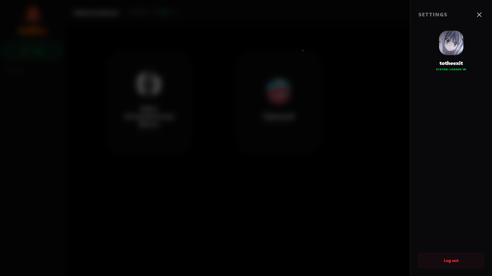
</p>

**First build fails on Raspberry Pi**

Run with `sudo docker compose up -d --build` on the first boot. This is required once to allow the Lavalink container to install low-level audio kernel modules. Subsequent starts do not require elevated privileges.

**YouTube / external sources not working**

External network sources are disabled by default. To enable them:
1. Add a compatible Lavalink plugin to `application.yml` (see comments in `application.example.yml`).
2. On the first run with the plugin, Lavalink will print OAuth2 authentication instructions to its container logs (`docker logs lavalink`). Follow them using a dedicated Google account.
3. It is **strongly recommended** not to use a primary Google account for this, as Lavalink's OAuth tokens may be revoked by Google.

**WebUI shows "EMPTY QUEUE" but music is playing**

This usually means the WebSocket connection was dropped and not reconnected. Refresh the page; the SPA will re-establish the connection and sync state immediately.

**Lavalink container runs out of memory**

Increase the `-Xmx512M` flag in `docker-compose.yml` under the `lavalink` service's `_JAVA_OPTIONS` environment variable. On a 4 GB Raspberry Pi, `-Xmx768M` is safe if the Rust core remains under 50 MiB.

**Static IP / Ngrok tunnel not working after reboot**

Confirm that the DHCP reservation is bound to the correct MAC address in your router admin panel. If using a USB Wi-Fi adapter, its MAC address may differ from the onboard adapter. Re-check and update the reservation.

**WebUI layout broken on very small screens**

The interface adapts automatically down to approximately 360 px wide. Below that threshold, some panels may clip. Use the mobile-optimised layout (portrait orientation) for the best experience on phones.

<p align="center">
  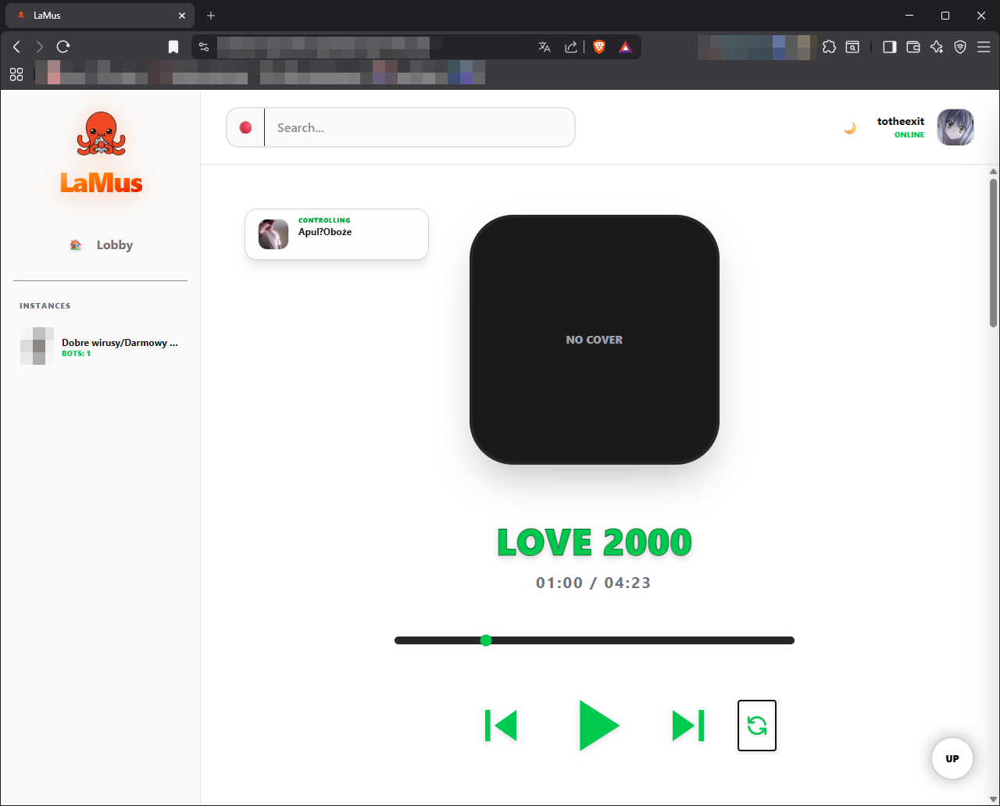
  &nbsp;&nbsp;
  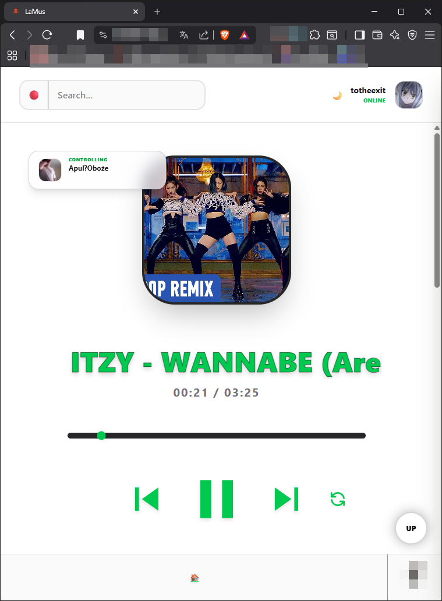
</p>

---

## Roadmap

### Patch 0.4.0 — Auto-Volume & Project Infrastructure
- Dedicated Lavalink plugin for automatic loudness normalization.
- Documentation overhaul and GitHub Wiki migration.
- Versioning and release workflow improvements.

### Patch 0.5.0 — Audio Experience Update
- Audio filters and equalizer presets.
- YouTube chapter support.

### Patch 0.6.0 — User Infrastructure
- User profiles and persistent settings.
- GDPR / EU compliance tools.
- User data management and migration framework.

### Patch 0.7.0 — User Features
- Favorites.
- Listening history.
- User statistics.
- Custom playlists.

### Patch 0.8.0 — WebUI File Manager
- Local library management.
- Upload and maintenance tools.

### Patch 0.9.0 — Advanced Administration
- God Panel.
- Hot Reload.
- Instance management tools.

### Patch 1.0.0 — Database Evolution
- Evaluate migration to a more advanced database backend if required.

---

## License

LaMus is an open-source project developed as an academic engineering work at the Faculty of Technical Sciences, University of Warmia and Mazury in Olsztyn. Contributions and forks are welcome.

---

*Author: Arkadiusz Wewersajtys — [GitHub](https://github.com/ToThe3xit)*