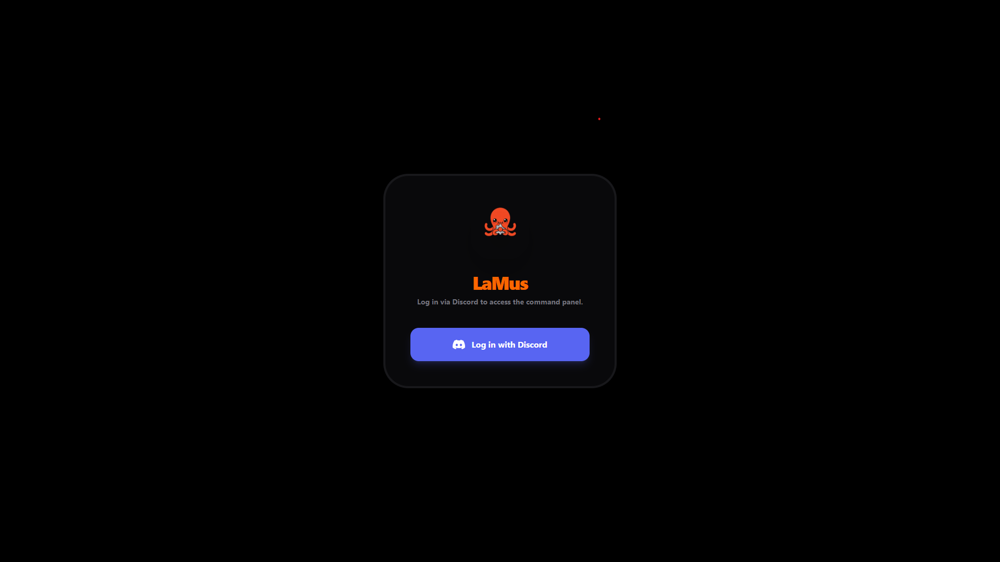
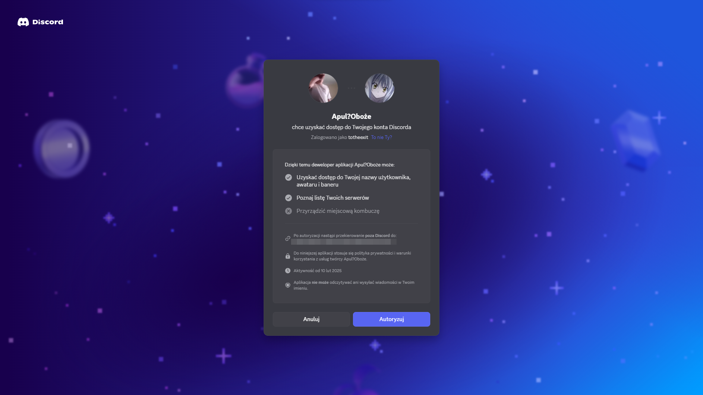
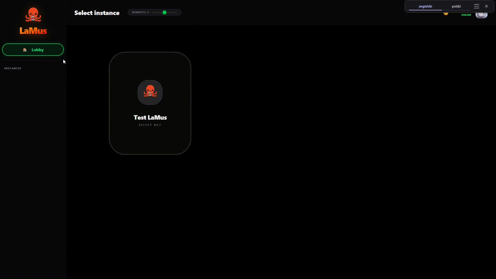
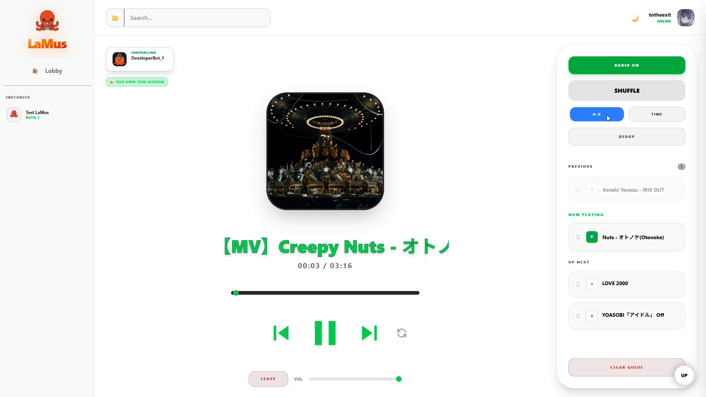
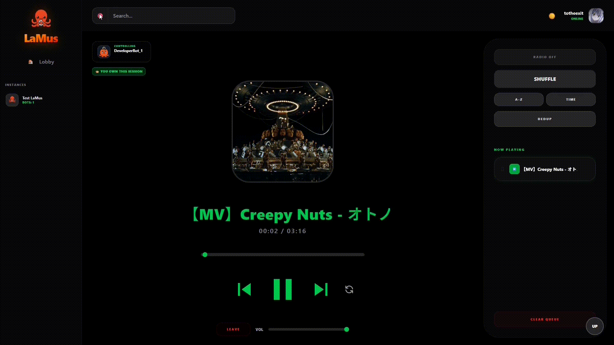
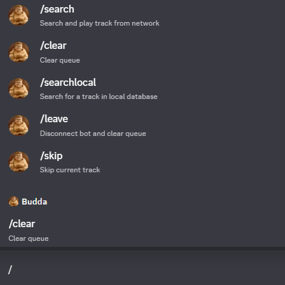
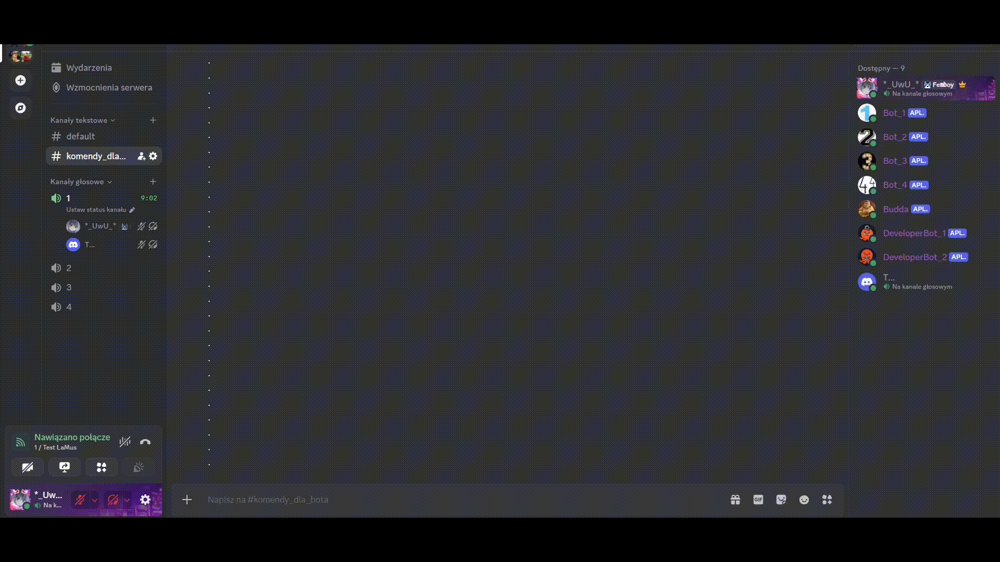
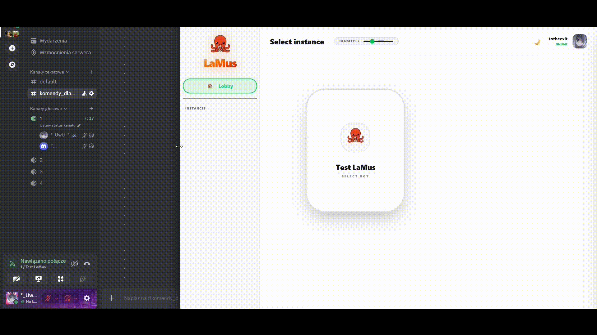
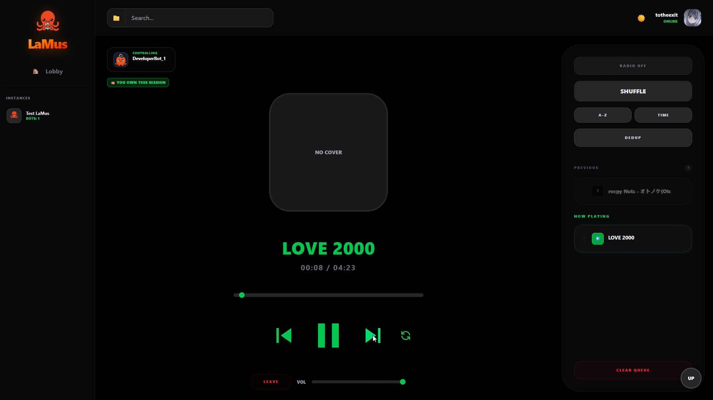

# LaMus — Self-Hosted Discord Music Platform

<p align="center">
  
</p>

<p align="center">
  <sub><i>Self-hosted Discord music platform built for Raspberry Pi, ARM devices and private deployments.</i></sub>
</p>

<p align="center">
  
  
  
  
  
  
</p>

<p align="center">
  <strong>Modern WebUI &nbsp;•&nbsp; Real-Time Sync &nbsp;•&nbsp; Multi-Instance &nbsp;•&nbsp; Raspberry Pi Friendly</strong>
</p>

---

LaMus is a self-hosted Discord music platform built with Rust, React and Lavalink. Unlike public music bots, every instance is fully owned and controlled by its operator.

It provides a modern browser interface, Discord slash command integration, local library playback, real-time synchronization and democratic session management. Designed primarily for Raspberry Pi and other low-power ARM devices, the idle memory footprint of the Rust core sits at around 11 MiB.

---

## Features

- **Modern WebUI** — React-based browser interface for everyday control without typing chat commands.
- **Real-Time Synchronization** — WebSocket-powered state updates across all connected clients instantly.
- **Multi-Instance Support** — Manage multiple independent music bots from a single panel.
- **Local & Network Audio** — Stream from external sources or play from a private local library.
- **Discord OAuth2 Authentication** — Secure login using existing Discord accounts, no separate registration.
- **Session Ownership** — Ownership-based session management that gives the session creator primary control while supporting collaborative interaction.
- **Democratic Control (Vote-Skip)** — Configurable voting system for disruptive actions in shared sessions.
- **Discord Slash Commands** — Full `/search`, `/skip`, `/leave`, `/pause`, `/resume`, `/clear` integration.
- **Smart Autoplay** — Automatically continues playback when the queue becomes empty.
- **Local Search Engine** — Pre-computed token index for instant searching across large libraries.
- **Responsive Design** — Fully functional on desktop, tablet and mobile.
- **Docker Deployment** — One-command setup via Docker Compose.

---

## Showcase

### Login

Authentication is handled entirely through Discord OAuth2. No separate account is required.

<p align="center">
  
  &nbsp;&nbsp;
  
</p>

---

### Getting Started

The demo below presents the complete onboarding flow: server selection → bot selection → voice channel selection → bot join → track search → playback start.

<p align="center">
  
</p>

---

### Main Player

The primary control panel provides playback controls, progress and volume sliders, queue management, session ownership indicators and real-time synchronization.

<p align="center">
  
</p>

---

### Local Library

LaMus supports large local music collections and seamless transitions between local and network playback. The demo below shows local search, queue insertion, source switching, playback continuation and no-cover fallback handling.

<p align="center">
  
</p>

---

### Discord Integration

LaMus can be controlled directly from Discord through slash commands. The observer bot registers commands globally and routes them to the correct bot instance based on the caller's current voice channel.

**Supported commands:** `/search` `/searchlocal` `/skip` `/leave` `/pause` `/resume` `/clear`

<p align="center">
  
</p>

<p align="center">
  
</p>

---

### Real-Time Synchronization & Multi-User Control

The flagship feature of LaMus is synchronized multi-user interaction. The demo below shows both an admin and a regular user interacting with the same session simultaneously, including the full Vote-Skip workflow, theme switching, responsive layout and Discord integration running in parallel.

<p align="center">
  
</p>

---

### No Cover Fallback

When a track has no artwork metadata, LaMus falls back to a clean placeholder interface while preserving full playback functionality.

<p align="center">
  
</p>

---

## Tech Stack

| Layer               | Technology            |
| ------------------- | --------------------- |
| Backend             | Rust + Tokio          |
| Frontend            | React + TypeScript    |
| Styling             | Tailwind CSS v4       |
| Discord Integration | Serenity + Songbird   |
| Audio Engine        | Lavalink (JVM)        |
| Communication       | REST + WebSocket      |
| Authentication      | Discord OAuth2        |
| Deployment          | Docker Compose        |

---

## Quick Start

```bash
git clone <repository-url>
cd lamus
touch db.yaml tracks_normalized_preview.yaml
```

Copy and fill in configuration files:

```bash
cp config.example.yaml config.yaml
cp application.example.yml application.yml
cp docker-compose.example.yml docker-compose.yml
cp webui/.env.example webui/.env
```

Create a `tracks/` directory and add your music files:

```bash
mkdir tracks/
# Copy .mp3 / .flac / .wav files into ./tracks/
```

```bash
docker compose up -d --build
```

For complete deployment instructions, Raspberry Pi setup, CGNAT bypass configuration and all config reference, see the **[GitHub Wiki](../../wiki)**.

---

## Documentation

Full technical documentation is available in the **[GitHub Wiki](../../wiki/Home)**.

| Topic | Description |
| --- | --- |
| [Installation Guide](../../wiki/Installation) | Step-by-step setup from scratch |
| [Architecture Overview](../../wiki/Architecture) | System design and data flow |
| [Democratic Control](../../wiki/Vote-Skip-System) | Vote-Skip system explained |
| [Deployment Guide](../../wiki/Deployment) | Docker, volumes and networking |
| [Raspberry Pi Setup](../../wiki/Raspberry-Pi-Setup) | ARM deployment and CGNAT bypass |
| [Troubleshooting](../../wiki/Troubleshooting) | Common issues and fixes |
| [Roadmap](../../wiki/Roadmap) | Planned features and future releases |

## Project Status

**Current stable release:** `v0.3.1`

**Status:** `Active development`

**Recent features:** Session Ownership · Democratic Control (Vote-Skip) · Queue Shuffle · Queue Deduplication · Queue Sorting · Smart Autoplay · Multi-Language Support (i18n)

**Recent fixes:** Active Bot List race condition · Vote workflow improvements · Mobile UI refinements · Synchronization stability

---

## License

[MIT License](LICENSE)

---

## Author

**Arkadiusz Wewersajtys** — [github.com/ToThe3xit](https://github.com/ToThe3xit)